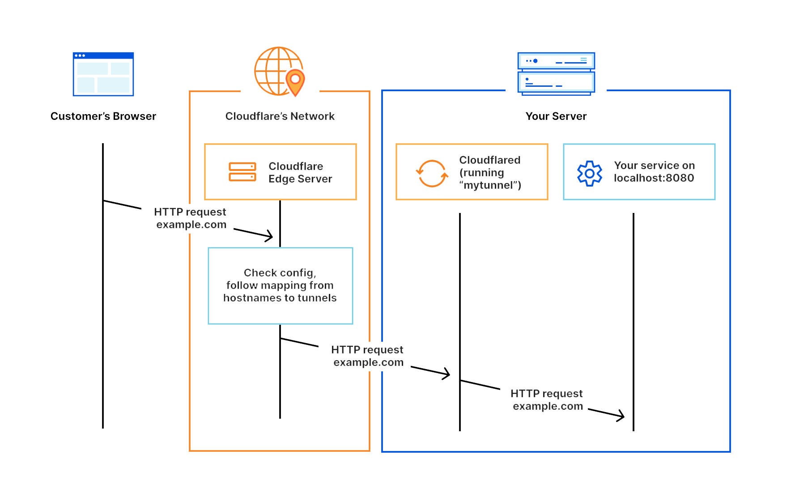

<h1 align="center">在 GitHub Action 上部署 OCR 服务</h1>

### 请自觉遵守[MIT License](./LICENSE)

## 一、特性

- [x] 废话没有，开箱即用

- [x] 自动下载，自动编译

- [x] 内网穿透，直接访问

- [x] 随机链接，防止盗用

- [x] 似乎支持了手写

## 二、待改进

- 公式转 $L^{A}T_{E}X$

- ~~手写~~

- 表格OCR

- 段落合并

## 三、食用方法

*fork*本仓库，直接*Action*运行

**提示:** 如果要采用固定接口，请切换*branch*到**API**

家用(即:树莓派,等设备)**CPU**部署请参考[setup-cpu.md](./setup-cpu.md)
  
**注意1:** 准备时间长是正常现象.
   
**注意2:** *API*分支维护完成.

## 四、原理

